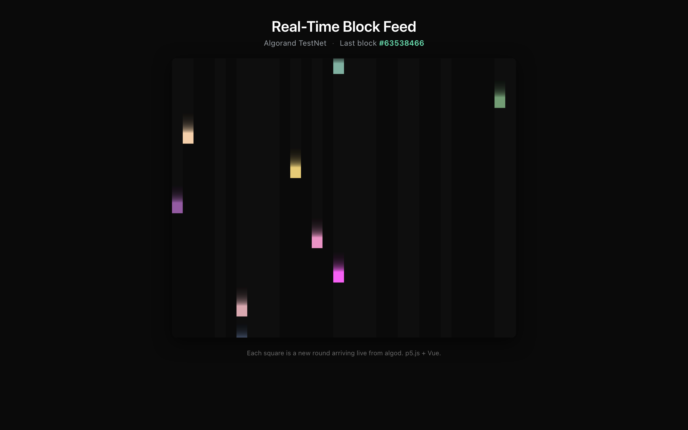

# Algorand Real-Time Block Visualizer

> Live, generative data-art feed of the Algorand TestNet — one falling block per confirmed round.

[](https://algo-vue-rt.surge.sh)
[](https://algorand.co)
[](https://v2.vuejs.org/)
[](https://p5js.org/)
[](https://github.com/algorand/js-algorand-sdk)
[](https://algonode.io)
[](./LICENSE)



**Live demo:** [https://algo-vue-rt.surge.sh](https://algo-vue-rt.surge.sh) — the canvas stays blank for a few seconds, then a new colored square drops in every time the TestNet confirms a round (~3.3s cadence).

---

## What it does

The app opens an `algod` client against the Algorand TestNet, waits for each new block with `statusAfterBlock`, and renders every confirmation as a uniquely colored square that falls down a p5.js canvas. A semi-transparent background frame leaves motion trails, so the on-chain block rate becomes a visible rhythm rather than a console log.

It is a small, deliberately minimal piece — a creative-coding lens on a live chain, originally written as a tutorial for **Algorand Developer** in 2020.

---

## Tech stack

- **Vue 2** + Vue CLI 4 — Vue 2 idiomatic, kept on purpose to preserve the original tutorial code shape.
- **[`algosdk` v2](https://github.com/algorand/js-algorand-sdk)** — migrated from v1.6 in the 2026 refresh.
- **[`vue-p5`](https://github.com/Kasper24/VueP5)** — p5.js wrapper component for Vue.
- **[AlgoNode](https://algonode.io) public TestNet** (`https://testnet-api.algonode.cloud`) — no API key, no signup.
- Deployed as a static SPA on **[surge.sh](https://surge.sh)**.

---

## How it works

```
 AlgoNode TestNet
      │  https://testnet-api.algonode.cloud
      ▼
 algodClient.status() ─────────────► last-round
      │
      ▼
 loop: statusAfterBlock(round).do() ── wait for next block
      │
      ▼
 Algorand.vue ── emits "newBlock" ──► AlgoViz.vue
                                          │
                                          ▼
                              p5 canvas: spawn falling square
                              (random x, random RGB, motion trail)
```

Two components carry the whole thing:

- **`src/components/Algorand.vue`** — owns the algod client. Reads the current round once via `status()`, then sits in a `statusAfterBlock(round).do()` loop and emits a Vue event on every new round.
- **`src/components/AlgoViz.vue`** — owns the p5 sketch. Listens for the event, pushes a new block object (random `x`, random RGB) into a list, and the `draw` loop animates each one falling. A `background(0, 0, 0, alpha)` call each frame gives the trails.

No backend, no smart contract, no wallet. Read-only chain access.

---

## Run locally

```bash
git clone https://github.com/redcpp/algorand-vue-rt.git
cd algorand-vue-rt
npm install
npm run serve
# open http://localhost:8080
```

Production build:

```bash
npm run build      # emits to dist/
```

The AlgoNode TestNet endpoint is hard-wired in `src/components/Algorand.vue`. To point at MainNet or a private `algod`, edit the `algodClient` constructor there.

---

## 2026 modernization notes

The original code shipped in 2020. The refresh in this branch brings it back to life as a portfolio piece (see commits in this PR for SHAs):

- **AlgoNode replaces PureStake.** PureStake's public API was decommissioned in 2023. The visualizer now points at AlgoNode's free, no-key TestNet endpoint, so the demo runs for anyone who clones it.
- **`algosdk` v1.6 → v2.** Constructor and response-shape changes propagated through `Algorand.vue`; the round-polling loop now matches the v2 promise chain.
- **Removed Vue CLI scaffold cruft.** The unused `HelloWorld.vue` and starter boilerplate that shipped with the 2020 `vue-cli` template were trimmed.
- **UI polish for portfolio presentation.** Cleaner layout around the canvas; the page no longer looks like a Vue CLI default.
- **Deployed.** A live demo went up on [`algo-vue-rt.surge.sh`](https://algo-vue-rt.surge.sh) so the README has something to point at.

This refresh is part of a broader 2026 portfolio pass. The sister project [`redcpp/algorand-ipfs-js`](https://github.com/redcpp/algorand-ipfs-js) got the same treatment — same PureStake → AlgoNode migration, same `algosdk` v1 → v2 bump, plus a CLI rewrite — and is the flagship companion to this visualizer.

What was deliberately *not* changed: the Vue 2 major version. A Vue 3 / Vite rewrite would be reasonable, but the goal here was "boot cleanly on modern Node and run against a live chain", not "rewrite".

---

## Background & credits

This visualizer was written by **Diego Anaya** ([diegosaid.com](https://diegosaid.com)) in 2020, alongside an accompanying tutorial published on **Algorand Developer** ([archived snapshot](https://web.archive.org/web/20250123102822/https://developer.algorand.org/tutorials/real-time-block-visualizer-vue/)). Both the code and the tutorial are original work. The 2026 modernization is by the same author.

The companion repo [`redcpp/algorand-ipfs-js`](https://github.com/redcpp/algorand-ipfs-js) cross-references this project as the structural ancestor of its block-explorer demo.

---

## Related work

- **[`redcpp/algorand-ipfs-js`](https://github.com/redcpp/algorand-ipfs-js)** — flagship sibling. Secure file sharing on Algorand + IPFS with client-side AES-256, a CLI, and an on-chain index. Same 2020 → 2026 modernization story, at a larger scale.

---

## License

MIT — see [LICENSE](./LICENSE).
