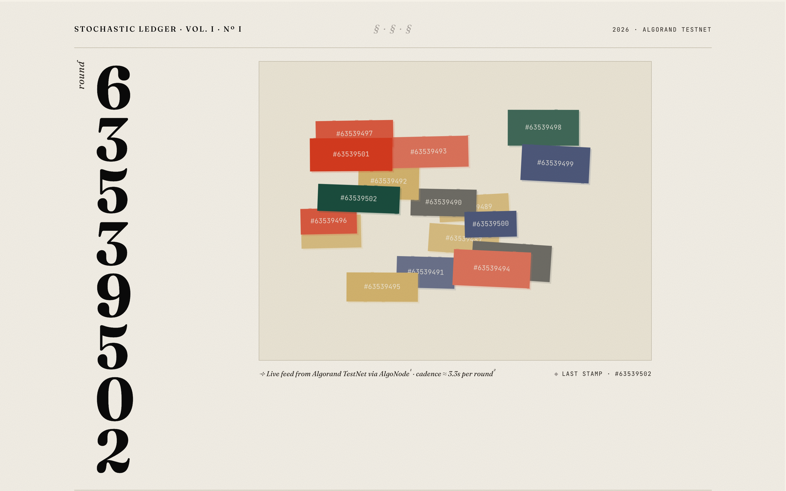

# Algorand Real-Time Block Visualizer

> *Stochastic Ledger* — a live generative-art reading of the Algorand TestNet. Every confirmed block perturbs a Perlin flow field; 460 particles paint the result as drifting rivers of ink.

[](https://algo-vue-rt.surge.sh)
[](https://algorand.co)
[](https://v2.vuejs.org/)
[](https://p5js.org/)
[](https://github.com/algorand/js-algorand-sdk)
[](https://algonode.io)
[](./LICENSE)



**Live demo:** [https://algo-vue-rt.surge.sh](https://algo-vue-rt.surge.sh) — the flow field drifts continuously; watch it lurch and re-color each time the TestNet confirms a round (~3.3s cadence).

---

## What it does

The app opens an `algod` client against the Algorand TestNet and waits for each new block. Instead of a chart or a log, the chain drives generative art: a Perlin **flow field** that 460 particles ride, painting persistent ink trails on a p5.js canvas.

Every confirmed block is decoded for its **VRF seed** — 32 bytes of consensus entropy. Those bytes deterministically perturb the field's topology (noise z-offset, rotation bias, frequency) and select a signature color that floods the field's "ink" particles. Two or three chain generations of color wash through the canvas at once, so the on-chain block rate becomes visible motion rather than a console line.

The page is framed as an editorial broadside — *Stochastic Ledger* — with the live round number set in large Fraunces type and the flow field as its plate.

It is a small, deliberately minimal piece — a creative-coding lens on a live chain, originally written as a tutorial for **Algorand Developer** in 2020 and substantially rebuilt in 2026.

---

## Tech stack

- **Vue 2.6** — kept on purpose to preserve the original 2020 tutorial code shape.
- **Vite 5** + `@vitejs/plugin-vue2` — modern dev server with HMR; no more `NODE_OPTIONS=--openssl-legacy-provider` for Node ≥17.
- **[`algosdk` v2](https://github.com/algorand/js-algorand-sdk)** — migrated from v1.6 in the 2026 refresh.
- **[`vue-p5`](https://github.com/Kasper24/VueP5)** — p5.js wrapper component for Vue; drives the flow-field canvas.
- **[AlgoNode](https://algonode.io) public TestNet** (`https://testnet-api.algonode.cloud`) — no API key, no signup.
- **Fraunces + JetBrains Mono** — the editorial type system behind the *Stochastic Ledger* layout.
- Deployed as a static SPA on **[surge.sh](https://surge.sh)**.

---

## How it works

```
 AlgoNode TestNet
      │  https://testnet-api.algonode.cloud
      ▼
 algodClient.status() ─────────────► lastRound
      │
      ▼
 loop: statusAfterBlock(round).do() ── wait for next block
      │
      ▼
 algodClient.block(round).do() ── decode VRF seed + tx count
      │
      ▼
 Algorand.vue ── emits "round-change" ──► AlgoViz.vue
   { round, digits, seed, txCount }            │
                                               ▼
                          p5 flow field: 8 numbers from the seed
                          remap noise z / rotation / frequency;
                          one byte picks the block's ink color
```

Two components carry the whole thing:

- **`src/components/Algorand.vue`** — owns the algod client. Reads the current round via `status()`, loops on `statusAfterBlock(round).do()`, and for each new round also fetches the full block with `block(round).do()` to decode its VRF seed and transaction count. Emits a `round-change` event; a failed block fetch degrades gracefully without stalling the loop.
- **`src/components/AlgoViz.vue`** — owns the p5 sketch. Maintains 460 particles on a Perlin flow field — ~63% faint "ghost" particles draw structure, ~37% bold "ink" particles draw color. The seed is split into eight normalized numbers that remap the noise z-offset, rotation bias and frequency; one byte selects the block's signature color. Trails persist and wash out over ~2.4s so the field keeps negative space instead of silting to mud.

No backend, no smart contract, no wallet. Read-only chain access.

---

## Run locally

```bash
git clone https://github.com/redcpp/algorand-vue-rt.git
cd algorand-vue-rt
npm install
npm run dev        # http://localhost:8080 with HMR
```

Build & preview:

```bash
npm run build      # outputs dist/
npm run preview    # serves dist/ on http://localhost:4173 for verification
```

The AlgoNode TestNet endpoint is hard-wired in `src/components/Algorand.vue`. To point at MainNet or a private `algod`, edit the `algodClient` constructor there.

---

## 2026 modernization notes

The original code shipped in 2020. The 2026 refresh brings it back to life as a portfolio piece:

- **AlgoNode replaces PureStake.** PureStake's public API was decommissioned in 2023. The visualizer now points at AlgoNode's free, no-key TestNet endpoint, so the demo runs for anyone who clones it.
- **`algosdk` v1.6 → v2.** Constructor and response-shape changes propagated through `Algorand.vue`; the round-polling loop now matches the v2 promise chain.
- **Removed Vue CLI scaffold cruft.** The unused `HelloWorld.vue` and starter boilerplate that shipped with the 2020 `vue-cli` template were trimmed.
- **Vue CLI 4 + webpack 4 → Vite 5** (with `@vitejs/plugin-vue2`). Dev server with HMR, sub-second cold start, and the `NODE_OPTIONS=--openssl-legacy-provider` workaround for modern Node is gone.
- **Rebuilt as *Stochastic Ledger*.** The 2020 piece rendered blocks as falling RGB squares. The 2026 version reframes the page as an editorial broadside — Fraunces + JetBrains Mono, a curated five-ink palette, the live round number in monumental type — and replaces the canvas with a Perlin flow field. Each block is decoded for its VRF seed, so real consensus entropy drives deterministic generative art rather than `Math.random()`.
- **Deployed.** A live demo runs at [`algo-vue-rt.surge.sh`](https://algo-vue-rt.surge.sh) so the README has something to point at.

This refresh is part of a broader 2026 portfolio pass. The sister project [`redcpp/algorand-ipfs-js`](https://github.com/redcpp/algorand-ipfs-js) got the same treatment — same PureStake → AlgoNode migration, same `algosdk` v1 → v2 bump, plus a CLI rewrite — and is the flagship companion to this visualizer.

What was deliberately *not* changed: the Vue 2 major version. A Vue 3 rewrite would be reasonable, but the goal here was "boot cleanly on modern Node and run against a live chain", not "rewrite".

---

## Background & credits

This visualizer was written by **Diego Anaya** ([diegosaid.com](https://diegosaid.com)) in 2020, alongside an accompanying tutorial published on **Algorand Developer** ([archived snapshot](https://web.archive.org/web/20250123102822/https://developer.algorand.org/tutorials/real-time-block-visualizer-vue/)). Both the code and the tutorial are original work. The 2026 modernization is by the same author.

The companion repo [`redcpp/algorand-ipfs-js`](https://github.com/redcpp/algorand-ipfs-js) cross-references this project as the structural ancestor of its block-explorer demo.

---

## Related work

- **[`redcpp/algorand-ipfs-js`](https://github.com/redcpp/algorand-ipfs-js)** — flagship sibling. Secure file sharing on Algorand + IPFS with client-side AES-256, a CLI, and an on-chain index. Same 2020 → 2026 modernization story, at a larger scale.

---

## License

MIT — see [LICENSE](./LICENSE).
